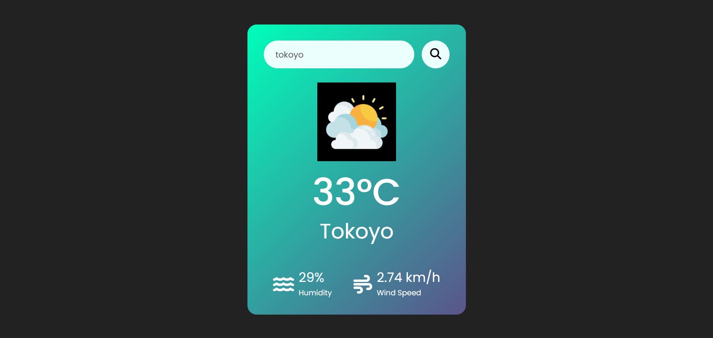

# 🌤️ Weather App

A simple weather app that fetches real-time weather data using the OpenWeather API and displays temperature, humidity, wind speed, and weather conditions with dynamic icons.

---

## 📸 Screenshots



---

## 🌍 Live Demo

🔗 **View live deployment** : [Weather-app](https://weather-app-orcin-seven-66.vercel.app/)

---

## 🚀 Features

- Search for weather by city name
- Displays temperature, humidity, and wind speed
- Dynamic weather icons based on conditions
- User-friendly UI
- Error handling for invalid city names

---

## 🛠️ Tech Stack

- HTML
- CSS
- JavaScript
- OpenWeather API

---

## 📂 Project Structure

```
📦 weather-app
├── 📂 images          # Weather condition icons
├── 📜 index.html      # Main HTML file
├── 📜 style.css       # Styling for the app
├── 📜 script.js       # JavaScript logic
└── 📜 README.md       # Project documentation
```
---

## ⚙️ Setup & Installation

1. Clone this repository:
   
   ```sh
   https://github.com/TonyStark-19/Weather-app.git
   ```
3. Open `index.html` in your browser.
4. Replace `YOUR_API_KEY_HERE` in `script.js` with your OpenWeather API key.
5. Start searching for weather updates!

---

## 📌 Usage

1. Enter a city name in the search bar.
2. Click the search button.
3. View real-time weather details including temperature, humidity, wind speed, and an appropriate weather icon.

---

## ❗ Issues & Improvements

- [ ] Improve UI design
- [ ] Add more weather details (e.g., sunrise/sunset, forecast)
- [ ] Implement geolocation support

---

## 🙌 Contributing

Feel free to fork this project, make improvements, and submit a pull request!

---

💡 *Built with ❤️ by Aditya chandel*
